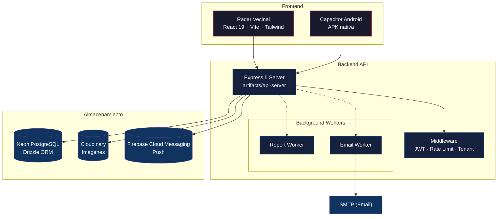
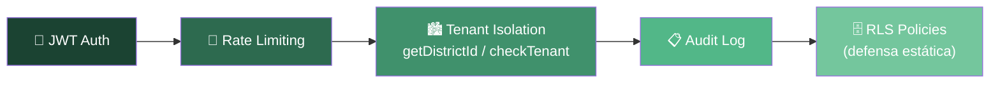
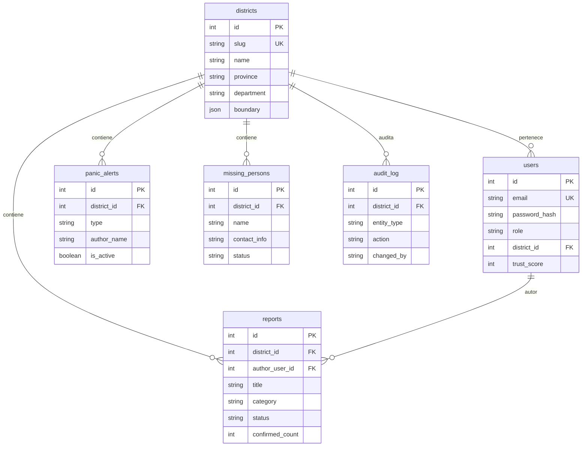

<div align="center">
  
  <h1 align="center" style="margin-top: 12px; font-size: 2.5em;">Radar Vecinal</h1>
  <p align="center">
    <strong>Plataforma de seguridad ciudadana para municipalidades del Perú</strong>
    <br />
    Reportes ciudadanos · Alertas de pánico · Personas desaparecidas · Dashboard municipal
  </p>
  <p align="center">
    <a href="#-demo"></a>
    <a href="#-requisitos"></a>
    <a href="#-stack-tecnológico"></a>
    <a href="#-stack-tecnológico"></a>
    <a href="#-stack-tecnológico"></a>
    <a href="#-licencia"></a>
    <a href="https://github.com/cponce123com-create/RadarVecinal/pulls"></a>
  </p>
  <br />
</div>

---

## 📋 Tabla de Contenidos

- [🎯 Visión General](#-visión-general)
- [✨ Características](#-características)
- [🏗️ Arquitectura](#️-arquitectura)
- [🛠️ Stack Tecnológico](#️-stack-tecnológico)
- [📦 Estructura del Monorepo](#-estructura-del-monorepo)
- [🚀 Inicio Rápido](#-inicio-rápido)
- [🔧 Configuración](#-configuración)
- [📡 API Endpoints](#-api-endpoints)
- [🗄️ Base de Datos](#️-base-de-datos)
- [📱 App Móvil (Android)](#-app-móvil-android)
- [🌐 Despliegue](#-despliegue)
- [🤝 Contribución](#-contribución)
- [📄 Licencia](#-licencia)

---

## 🎯 Visión General

**Radar Vecinal** conecta a **vecinos** con su **municipalidad** para mejorar la seguridad ciudadana en tiempo real.

| Vecino reporta | Municipalidad recibe | Comunidad confirma |
|:---:|:---:|:---:|
| 📍 Incidencias con GPS | 📊 Dashboard en vivo | ✅ Verificación colaborativa |
| 🆘 Alertas de pánico | 🔔 Notificaciones push | 🏆 TrustScore por vecino |
| 👤 Personas extraviadas | 📋 Sistema de asignación | 📈 Estadísticas abiertas |

> **🇵🇪 Hecho para el Perú** — Diseñado específicamente para municipalidades peruanas, cumpliendo con la **Ley N° 29733** (Protección de Datos Personales) y adaptado a la organización territorial por distritos, provincias y departamentos.

---

## ✨ Características

<div align="center">

| Funcionalidad | Vecino | Municipalidad | Detalle técnico |
|:---|---|:---:|:---:|
| 📍 **Reporte ciudadano** | Reporta incidencias con foto y GPS | Recibe y clasifica | Express + Drizzle + Cloudinary |
| 🆘 **Alerta de pánico** | Botón de emergencia 1-click | SSE en tiempo real + FCM push | Server-Sent Events + Firebase |
| 👤 **Personas desaparecidas** | Registro con datos y foto | Difusión y seguimiento | PostgreSQL + Cloudinary |
| 📊 **Dashboard municipal** | — | Estadísticas por distrito | Drizzle queries agregadas |
| 🔔 **Notificaciones push** | Sí (Android) | Asignación y updates | Firebase Cloud Messaging |
| 🧑‍💼 **Roles** | Vecino | Admin / Moderador / Viewer | JWT + refresh tokens |
| 🏙️ **Multi-tenant** | Solo su distrito | Solo su distrito | Aislamiento por `districtId` |
| 📱 **App Android** | Capacitor 7 | — | APK nativa con push |
| 📋 **Mensajería** | Recibe respuestas | Envía mensajes personalizados | Email (SMTP) + App |
| ✅ **Verificación comunitaria** | Confirma soluciones | Cierra reportes | Confirmación colectiva |

</div>

---

## 🏗️ Arquitectura



### 🔒 Seguridad por Capas



---

## 🛠️ Stack Tecnológico

<div align="center">

| Capa | Tecnología | Versión |
|:---|---|:---:|
| 🌐 **Frontend** | React + Vite + Tailwind CSS + shadcn/ui | React 19 |
| ⚙️ **Backend** | Express + Pino Logger + Helmet | Express 5 |
| 🗄️ **Base de Datos** | Neon PostgreSQL + Drizzle ORM | PG 15 |
| 📱 **Móvil** | Capacitor | Capacitor 7 |
| 🔐 **Autenticación** | JWT + refresh tokens (bcrypt) | — |
| ☁️ **Imágenes** | Cloudinary | — |
| 🔔 **Push** | Firebase Cloud Messaging (firebase-admin) | — |
| 📧 **Email** | Nodemailer (SMTP) | — |
| 🧠 **Lenguaje** | TypeScript (strict mode) | TS 5.x |
| 📦 **Monorepo** | pnpm workspaces | pnpm 9.x |
| 🚀 **Deploy** | Render (free tier) | — |

</div>

---

## 📦 Estructura del Monorepo

```
radar-vecinal/
├── artifacts/
│   ├── api-server/           # 🚀 Backend Express
│   │   └── src/
│   │       ├── routes/       # Endpoints REST
│   │       ├── lib/          # Utilidades (FCM, email, storage, cache)
│   │       ├── middlewares/  # Auth, audit
│   │       ├── workers/      # Background jobs
│   │       └── __tests__/    # Pruebas
│   ├── radar-vecinal/        # 🌐 Frontend React
│   │   └── src/
│   │       ├── pages/        # Páginas (Home, Map, Admin, etc.)
│   │       ├── components/   # Componentes reutilizables
│   │       ├── contexts/     # Auth, District
│   │       ├── hooks/        # Custom hooks
│   │       └── lib/          # Utilidades
│   └── mockup-sandbox/       # 🎨 Sandbox de diseño
├── lib/
│   ├── db/                   # 🗄️ Base de datos (schema, migraciones)
│   ├── api-spec/             # 📐 OpenAPI / Orval
│   ├── api-zod/              # ✅ Schemas Zod compartidos
│   ├── api-client-react/     # 🔌 Cliente API generado
│   └── object-storage-web/   # ☁️ Uploader Cloudinary
├── scripts/                  # 🔧 Utilidades (seed, hello)
├── android/                  # 📱 Proyecto Android nativo (Capacitor)
└── .env.example              # 📋 Template de variables de entorno
```

---

## 🚀 Inicio Rápido

### Prerrequisitos

- **Node.js** ≥ 20.x
- **pnpm** ≥ 9.x (`npm install -g pnpm`)
- **PostgreSQL** ≥ 15 (recomendado: [Neon](https://neon.tech) — free tier)

### Instalación

```bash
# 1. Clonar
git clone https://github.com/cponce123com-create/RadarVecinal.git
cd RadarVecinal

# 2. Instalar dependencias (todo el monorepo)
pnpm install

# 3. Configurar entorno
cp .env.example .env
# Edita .env con tus credenciales

# 4. Ejecutar migraciones
pnpm --filter @workspace/db run migrate

# 5. Iniciar backend (dev con hot-reload)
pnpm --filter @workspace/api-server run dev

# 6. En otra terminal — iniciar frontend
pnpm --filter @workspace/radar-vecinal run dev
```

> 💡 El backend corre en `http://localhost:3000` y el frontend en `http://localhost:5173`.

---

## 🔧 Configuración

### Variables de Entorno

| Variable | Obligatoria | Descripción |
|:---|---|:---|
| `DATABASE_URL` | ✅ | Conexión Neon PostgreSQL (usar `-pooler` en producción) |
| `JWT_SECRET` | ✅ | `openssl rand -base64 32` |
| `SUPER_ADMIN_EMAIL` | ✅ | Email del super administrador **(sin valor por defecto)** |
| `PORT` | ✅ | Render asigna `10000` automáticamente |
| `NODE_ENV` | ✅ | `development` o `production` |
| `CORS_ORIGIN` | ✅ | Orígenes permitidos separados por coma |
| `CLOUDINARY_CLOUD_NAME` | ✅ | De [Cloudinary Console](https://cloudinary.com/console) |
| `CLOUDINARY_API_KEY` | ✅ | De Cloudinary Console |
| `CLOUDINARY_API_SECRET` | ✅ | De Cloudinary Console |
| `RENIEC_API_TOKEN` | ✅ | Token de [api.decolecta.com](https://api.decolecta.com) |
| `SEED_KEY` | ✅ | Clave para seed **(solo en desarrollo)** |
| `FCM_SERVICE_ACCOUNT` | ❌ | JSON de Firebase Admin SDK (para push) |
| `SMTP_HOST/PORT/USER/PASS/FROM` | ❌ | Configuración SMTP (para emails) |
| `APP_URL` | ❌ | URL pública para enlaces en emails |

### Comandos Útiles

```bash
pnpm run build             # Build completo (backend + frontend)
pnpm run typecheck         # Verificar tipos TypeScript
pnpm run lint              # Linter
pnpm run test              # Tests
pnpm --filter @workspace/db run migrate  # Migraciones DB
```

---

## 📡 API Endpoints

### Autenticación

| Método | Ruta | Auth | Descripción |
|:---:|:---|:---:|:---|
| `POST` | `/api/auth/register` | ❌ | Registrar vecino |
| `POST` | `/api/auth/login` | ❌ | Iniciar sesión |
| `POST` | `/api/auth/refresh` | ❌ | Renovar token JWT |
| `POST` | `/api/auth/logout` | ✅ | Cerrar sesión |
| `POST` | `/api/auth/claim-superadmin` | ✅ | Reclamar rol super_admin |

### Reportes

| Método | Ruta | Auth | Descripción |
|:---:|:---|:---:|:---|
| `GET` | `/api/reports` | ❌ | Listar reportes (filtrables) |
| `POST` | `/api/reports` | ❌ | Crear reporte |
| `GET` | `/api/reports/:id` | ❌ | Detalle del reporte |
| `PATCH` | `/api/reports/:id` | ✅ | Actualizar reporte (admin) |
| `POST` | `/api/reports/:id/confirm` | ❌ | Confirmar reporte |
| `POST` | `/api/reports/:id/vote` | ❌ | Votar reporte |

### Alertas de Pánico

| Método | Ruta | Auth | Descripción |
|:---:|:---|:---:|:---|
| `GET` | `/api/panic-alerts` | ❌ | Listar alertas activas |
| `POST` | `/api/panic-alerts` | ❌ | Crear alerta de pánico |
| `GET` | `/api/panic-alerts/stream` | ❌ | SSE en tiempo real |
| `PATCH` | `/api/panic-alerts/:id` | ✅ | Actualizar estado (admin) |

### Personas Desaparecidas

| Método | Ruta | Auth | Descripción |
|:---:|:---|:---:|:---|
| `GET` | `/api/missing-persons` | ❌ | Listar desaparecidos |
| `POST` | `/api/missing-persons` | ❌ | Reportar desaparición |

### Consulta RENIEC

| Método | Ruta | Auth | Descripción |
|:---:|:---|:---:|:---|
| `GET` | `/api/reniec/lookup/:dni` | 🔒 **Backoffice** | Consultar DNI (limitado: 10/hora) |

### Almacenamiento

| Método | Ruta | Auth | Descripción |
|:---:|:---|:---:|:---|
| `POST` | `/api/storage/uploads/request-url` | ✅ | Solicitar URL de subida Cloudinary |

> 🔒 = Requiere autenticación | 🔒 **Rol específico** = Requiere rol específico

---

## 🗄️ Base de Datos



---

## 📱 App Móvil (Android)

La app nativa de Android está construida con **Capacitor 7** y se distribuye como APK.

```bash
# Generar APK de debug
cd android
./gradlew assembleDebug

# Generar APK de release (requiere keystore)
./gradlew assembleRelease
```

> ⚠️ Para distribuir fuera de debug, genera un keystore:
> ```bash
> keytool -genkey -v -keystore release.keystore -alias radarvecinal 
>   -keyalg RSA -keysize 2048 -validity 10000
> ```

La app recibe **notificaciones push nativas** a través de Firebase Cloud Messaging para:
- 🚨 Alertas de pánico en tu distrito
- 📋 Mensajes de la municipalidad
- ✅ Actualizaciones de estado de tus reportes

---

## 🌐 Despliegue

### Render (recomendado)

| Paso | Acción |
|:---:|:---|
| 1 | Crear Web Service en Render conectado a GitHub |
| 2 | **Build Command:** `./render-build.sh` |
| 3 | **Start Command:** `cd artifacts/api-server && node --enable-source-maps ./dist/index.mjs` |
| 4 | Configurar **todas las variables de entorno** del panel |
| 5 | Crear base de datos **Neon PostgreSQL** |
| 6 | Ejecutar migraciones: `pnpm --filter @workspace/db run migrate` |
| 7 | ✅ Verificar health check: `GET /api/health` |

### Checklist Post-Despliegue

```bash
# 1. Health check
curl https://tu-dominio.onrender.com/api/health

# 2. Probar login
curl -X POST https://tu-dominio.onrender.com/api/auth/login 
  -H "Content-Type: application/json" 
  -d '{"email":"test@ejemplo.com","password":"..."}'

# 3. Verificar que seed está deshabilitado
curl -X POST https://tu-dominio.onrender.com/api/seed
# → Debe responder 403

# 4. Verificar que RENIEC requiere auth
curl https://tu-dominio.onrender.com/api/reniec/lookup/12345678
# → Debe responder 401

# 5. Verificar frontend
# Abrir https://tu-dominio.onrender.com en el navegador
```

---

## 🤝 Contribución

¡Las contribuciones son bienvenidas! Sigue estos pasos:

1. **Haz fork** del repositorio
2. **Crea una rama:** `git checkout -b feature/mi-mejora`
3. **Desarrolla** con estilo consistente:
   - TypeScript strict mode
   - ESLint + Prettier
   - Tests donde aplique
4. **Verifica:** `pnpm run typecheck && pnpm run lint && pnpm run test`
5. **Envía un Pull Request** describiendo tus cambios

### Reportar bugs

Si encuentras un bug, abre un [Issue](https://github.com/cponce123com-create/RadarVecinal/issues) con:

- 📝 Descripción clara del problema
- 🔄 Pasos para reproducir
- 📸 Captura de pantalla (si aplica)
- 🌐 Entorno (navegador, dispositivo, etc.)

---

## 📄 Licencia

**MIT** — Haz lo que quieras con este proyecto, pero da crédito donde corresponde.

---

<div align="center">
  <sub>
    Hecho con ❤️ para las municipalidades del Perú 🇵🇪
    <br />
    <a href="https://github.com/cponce123com-create/RadarVecinal">GitHub</a> ·
    <a href="#-visión-general">Volver arriba ↑</a>
  </sub>
</div>
